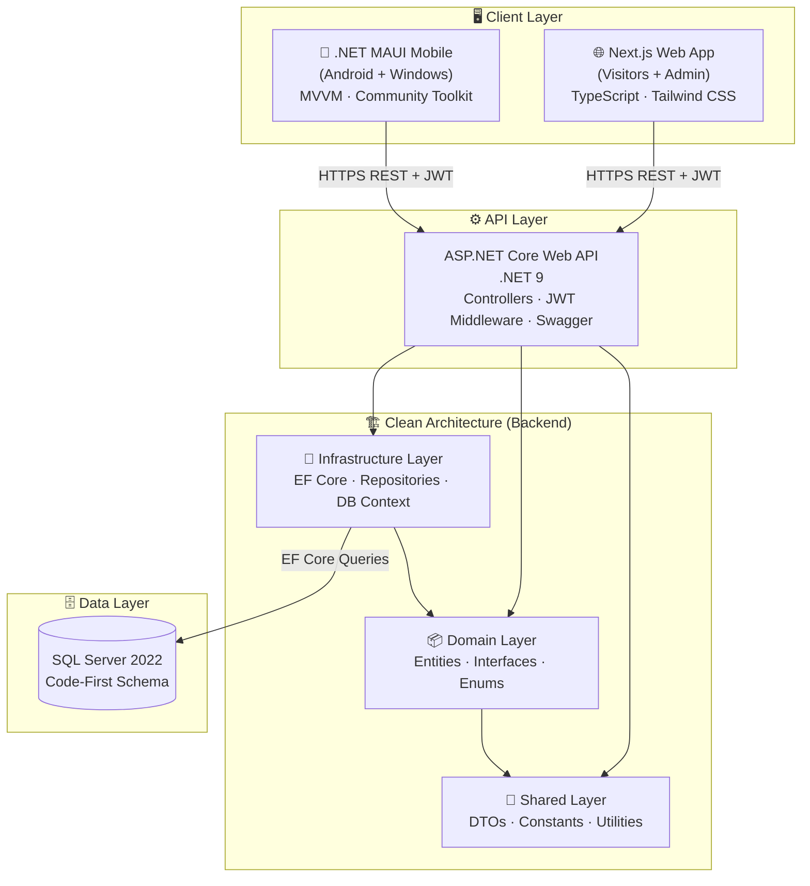
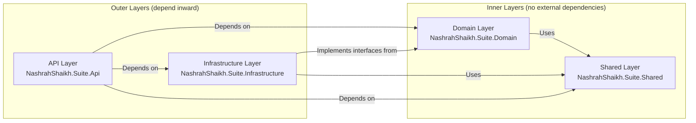
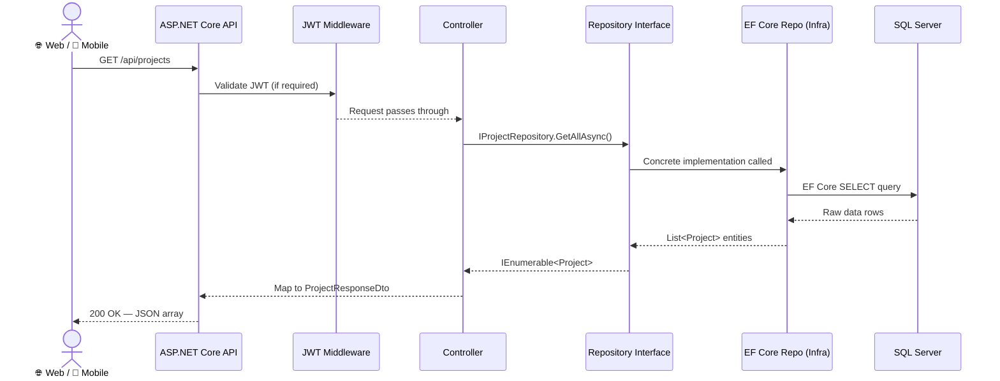
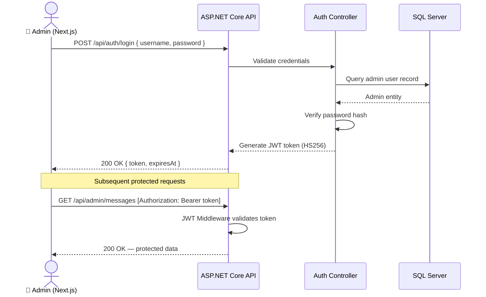
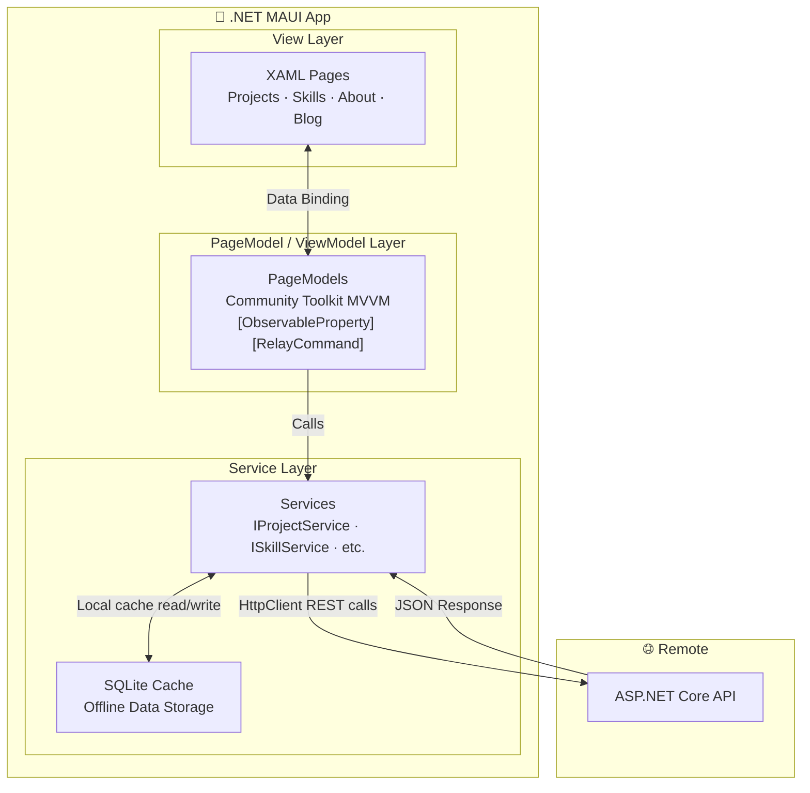
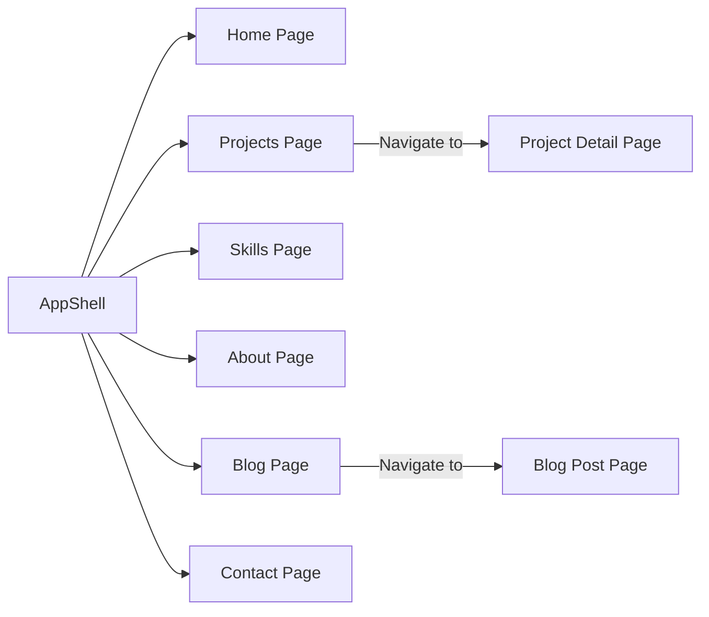
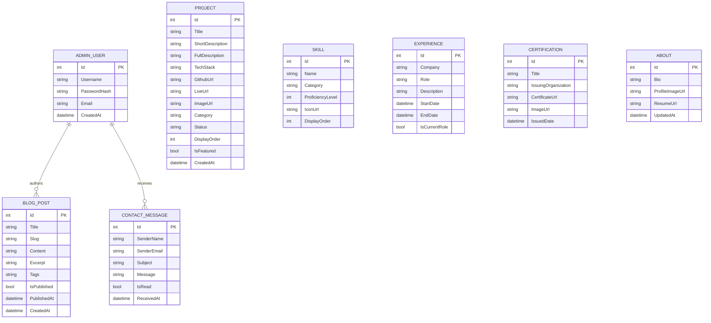
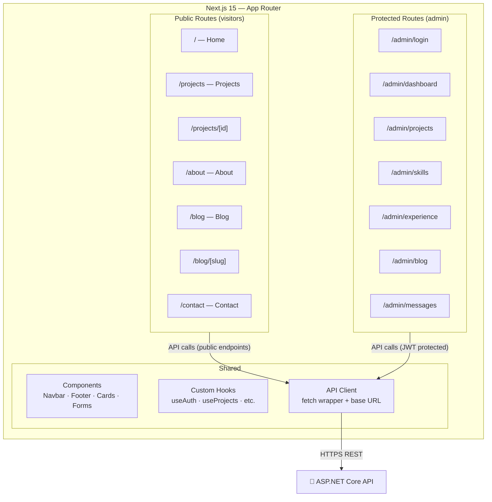
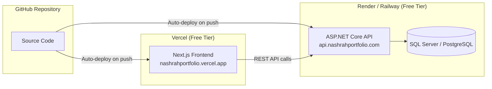

# 🏛️ Architecture — Nashrah Portfolio Suite

> **Document:** 02 — System Architecture & Design  
> **Author:** Nashrah Fatema Shaikh  
> **Last Updated:** 2026-07-31  

---

## 📐 System Overview

The Nashrah Portfolio Suite is a **tri-client, single-API** architecture. Three separate client applications — a Next.js web app, a .NET MAUI mobile app, and an admin panel — all consume one centralized ASP.NET Core REST API, which in turn follows **Clean Architecture** internally.

---

## 🗺️ High-Level System Diagram

---

## 🏗️ Clean Architecture Breakdown

The backend is structured in **4 layers** following Clean Architecture principles — inner layers have **zero knowledge** of outer layers.

### Layer Responsibilities

| Layer | Project | Responsibility | Can depend on |
|-------|---------|----------------|---------------|
| **API** | `NashrahShaikh.Suite.Api` | HTTP endpoints, routing, middleware, DI wiring, Swagger | Domain, Infrastructure, Shared |
| **Domain** | `NashrahShaikh.Suite.Domain` | Business entities, repository interfaces, domain enums | Shared only |
| **Infrastructure** | `NashrahShaikh.Suite.Infrastructure` | EF Core DbContext, repository implementations, migrations | Domain, Shared |
| **Shared** | `NashrahShaikh.Suite.Shared` | DTOs (request/response), constants, utility helpers | Nothing (innermost) |

---

## 🔄 Request Flow — Visitor Reads Data

---

## 🔐 Authentication Flow — Admin Login

---

## 📱 Mobile MVVM Architecture (.NET MAUI)

### MAUI Shell Navigation

---

## 🗄️ Database Architecture

### Entity Relationship Overview

---

## 🌐 Frontend Architecture (Next.js)

---

## 🔁 Deployment Architecture (Planned)

---

## 🏷️ Key Design Decisions

| Decision | Choice | Reason |
|----------|--------|--------|
| Architecture | Clean Architecture | Separation of concerns, testability, scalability |
| API Style | REST (JSON) | Universal — works with web, mobile, and future clients |
| Auth | JWT (Bearer Token) | Stateless, works perfectly with SPA and mobile apps |
| ORM | Entity Framework Core Code-First | Clean C# models → auto schema generation |
| Mobile Pattern | MVVM + Community Toolkit | Data binding, testable ViewModels, MAUI best practice |
| Frontend Router | Next.js App Router | Layouts, Server Components, modern React patterns |
| Styling | Tailwind CSS | Utility-first, rapid development, consistent design |
| Database | SQL Server | Tight EF Core integration, familiar for .NET ecosystem |
